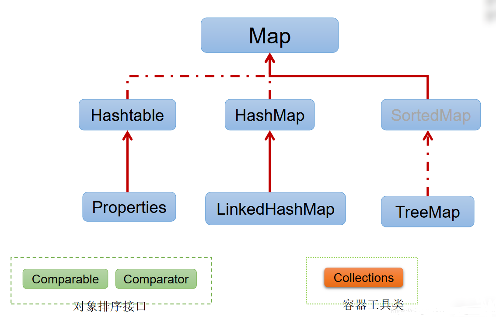

# 基础简介


## Map实现类细节
- Map：双列数据，存储key-value对的数据
  - HashMap：作为Map的主要实现类；线程不安全的，效率高；存储null的key和value  
  `JDK7底层：数组+链表`    
  `JDK8底层：数组+链表+红黑树`
    - LinkedHashMap：保证在遍历map元素时，可以按照添加的顺序实现遍历。  
    `原因：在原有的HashMap底层结构基础上，添加了一对指针，指向前一个和后一个元素。`   
    `对于频繁的遍历操作，此类执行效率高于HashMap。`  
  - TreeMap：保证按照添加的key-value对进行排序，实现排序遍历。此时考虑key的自然排序或定制排序。  
    `底层使用红黑树`
  - Hashtable：作为古老的实现类；线程安全的，效率低；不能存储null的key和value。
    - Properties：常用来处理配置文件。key和value都是String类型。

## Map结构理解
**Map中的key**：  
  - 无序的、不可重复的，使用Set存储所有的key >>> 所在的类要重写equals()和hashCode() （以HashMap为例）   

**Map中的value**：  
  - 无序的、可重复的，使用Collection存储所有的value >>> value所在的类要重写equals()  

`一个键值对：key-value构成了一个Entry对象。`  
`Map中的entry：无序的、不可重复的，使用Set存储所有的entry`

## HashMap源码常量
::: tip
DEFAULT_INITIAL_CAPACITY：16 > HashMap的默认容量  
DEFAULT_LOAD_FACTOR：0.75 > HashMap的默认加载因子  
threshold：扩容的临界值，=容量*填充因子：16 * 0.75 => 12  
TREEIFY_THRESHOLD：8 > Bucket中链表长度大于该默认值，转化为红黑树  
MIN_TREEIFY_CAPACITY：64 > 桶中的Node被树化时最小的hash表容量  
:::

## HashMap底层原理
HashMap map = new HashMap()  
在实例化以后，底层创建了长度是16的一维数组Entry[] table。

**JDK7**：map.put(key1,value1)  
- 首先，调用key1所在类的hashCode()计算key1哈希值，此哈希值经过某种算法计算以后，得到在Entry数组中的存放位置。
- 如果此位置上的数据为空，此时的key1-value1添加成功。 ----情况1
- 如果此位置上的数据不为空，(意味着此位置上存在一个或多个数据(以链表形式存在)),比较key1和已经存在的一个或多个数据的哈希值：
  - 如果key1的哈希值与已经存在的数据的哈希值都不相同，此时key1-value1添加成功。----情况2
  - 如果key1的哈希值和已经存在的某一个数据(key2-value2)的哈希值相同，继续比较：调用key1所在类的equals(key2)方法，比较：
    - 如果equals()返回false:此时key1-value1添加成功。----情况3
    - 如果equals()返回true:使用value1替换value2。  

`在不断的添加过程中，会涉及到扩容问题，当超出临界值(且要存放的位置非空)时，扩容。默认的扩容方式：扩容为原来容量的2倍，并将原有的数据复制过来。`  

**JDK8**：相较于jdk7在底层实现方面的不同：
- new HashMap():底层没有创建一个长度为16的数组
- jdk 8底层的数组是：Node[],而非Entry[]
- 首次调用put()方法时，底层创建长度为16的数组
- jdk7底层结构只有：数组+链表。jdk8中底层结构：数组+链表+红黑树。
  - 形成链表时，七上八下（jdk7:新的元素指向旧的元素。jdk8：旧的元素指向新的元素）
  - 当数组的某一个索引位置上的元素以链表形式存在的数据个数 > 8 且当前数组的长度 > 64时，此时此索引位置上的所数据改为使用红黑树存储。

## HashMap的hash()方法实现
**hashCode() 的高 16 位异或低 16 位实现的：(h = k.hashCode()) ^ (h >>> 16)**  
主要是从速度，功效和质量来考虑的，减少系统的开销，也不会造成因为高位没有参与下标的计算，从而引起的碰撞。
```java
public V put(K key, V value) {
    return putVal(hash(key), key, value, false, true);
}

static final int hash(Object key) {
    int h;
    return (key == null) ? 0 : (h = key.hashCode()) ^ (h >>> 16);
}
```

## HashMap扩容
当HashMap中的元素越来越多的时候，hash冲突的几率也就越来越高，因为数组的长度是固定的。所以为了提高查询的效率，就要对HashMap的数组进行扩容，而在HashMap数组扩容之后，最消耗性能的点就出现了：原数组中的数据必须重新计算其在新数组中的位置，并放进去，这就是resize。

当HashMap中的元素个数超过数组大小(数组总大小length,不是数组中个数size) x loadFactor时，就会进行数组扩容，loadFactor的默认值(DEFAULT_LOAD_FACTOR)为0.75，这是一个折中的取值。也就是说，默认情况下，数组大小(DEFAULT_INITIAL_CAPACITY)为16，那么当HashMap中元素个数超过16 x 0.75=12（这个值就是代码中的threshold值，也叫做临界值）的时候，就把数组的大小扩展为2x16=32，即扩大一倍，然后重新计算每个元素在数组中的位置，而这是一个非常消耗性能的操作，所以如果我们已经预知HashMap中元素的个数，那么预设元素的个数能够有效的提高HashMap的性能。

## HashMap put()方法的逻辑
1.首先判断当前哈希表是否已经被初始化，没有的话使用resize（）方法初始化，创建一个长度为16的数组  
2.判断当前位置有无节点，没有的话直接新new一个节点放入    
3.当前位置有节点需要判断key是否相同，相同的话需要新值覆盖旧值    
4.不相同的话判断当前节点是否是红黑树节点，是的话按照红黑树的插入方法插入    
5.不是的话进行链表的遍历，查看是否有key相同的节点，有的话新值覆盖旧值，没有的话正常来说走到最后一个节点，使用尾插法插入即可

## HashMap get()方法的逻辑
1.调用hash(K)方法（计算K的hash 值)从而获取该键值所在链表的数组下标  
2.判断下标对应的数组是否为空 空格就直接返回null；不为空，比较hash值，hash值相同之后才比较key是否相同，如果key相同，则返回该对象  
3.如果不相同就往下个节点寻找，下个节点是红黑树的话直接通过红黑树遍历寻找，不是红黑树直接遍历链表

## 什么是hash冲突？
所谓hash冲突，是由于哈希算法被计算的数据是无限的，而计算后的结果范围有限，所以总会存在不同的数据经过计算后得到的值相同，这就是哈希冲突。

## Map如何按照插入顺序排序？访问顺序排序？自然顺序排序？自定义排序？
```java
自然顺序排序： TreeMap   
自定义排序：利用 TreeMap 自带的可以传递一个 Comparator比较器的构造函数 或者 使用 工具类 Collections.sort()
/**
 * accessOrder true 访问顺序排序 false 插入顺序排序  默认是false
 */
public LinkedHashMap(int initialCapacity, float loadFactor, boolean accessOrder) {
  super(initialCapacity, loadFactor);
  this.accessOrder = accessOrder;
}
```

## ConcurrentHashMap put()方法
- 如果没有初始化，就调用 initTable() 方法来进行初始化；
- 如果没有 hash 冲突就直接 CAS 无锁插入；
- 如果需要扩容，就先进行扩容；
- 如果存在 hash 冲突，就加锁来保证线程安全，两种情况：一种是链表形式就直接遍历到尾端插入，一种是红黑树就按照红黑树结构插入；
- 如果该链表的数量大于阀值 8，就要先转换成红黑树的结构，break 再一次进入循
- 如果添加成功就调用 addCount() 方法统计 size，并且检查是否需要扩容。