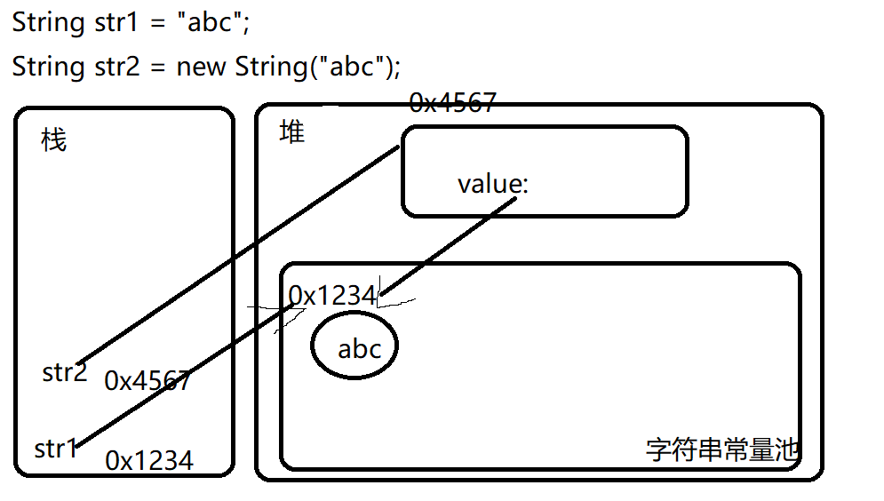
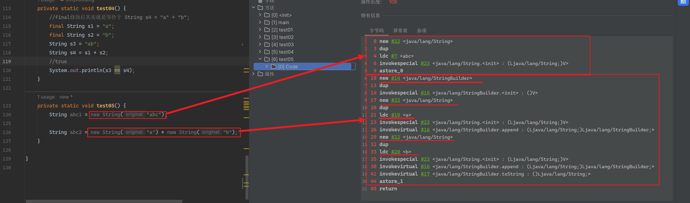
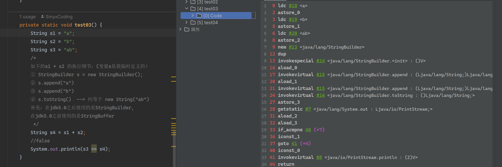
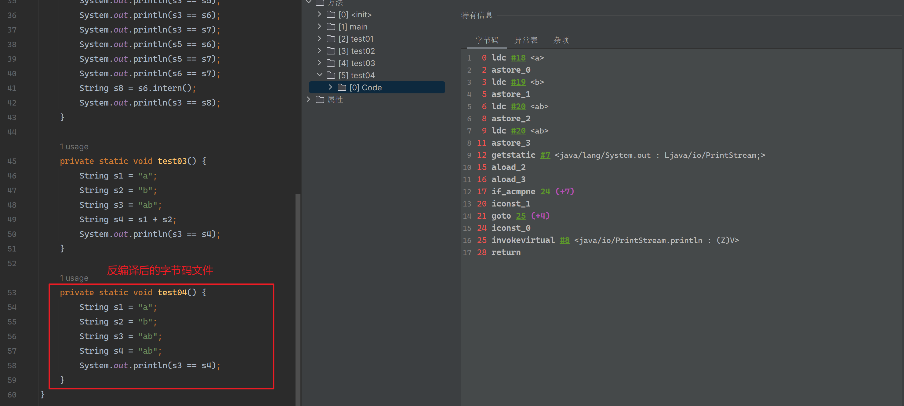
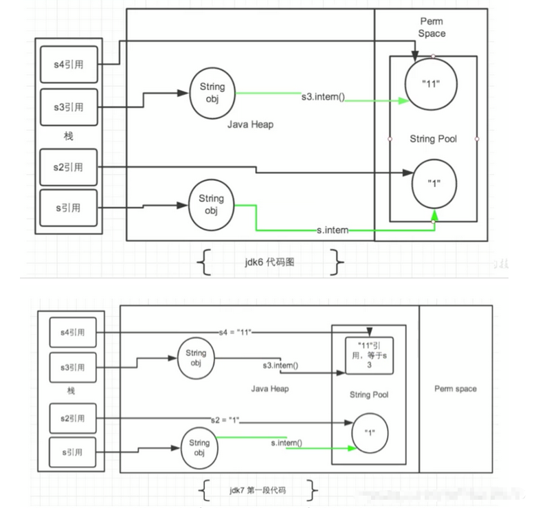
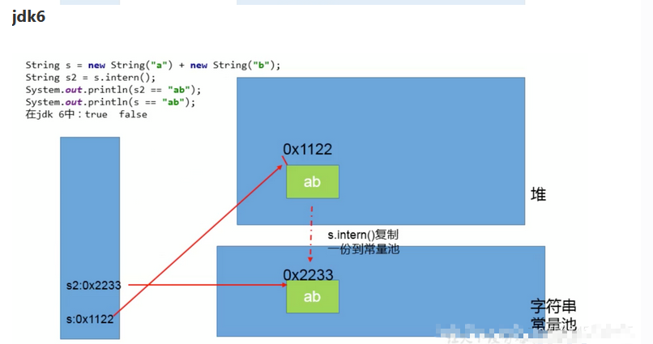
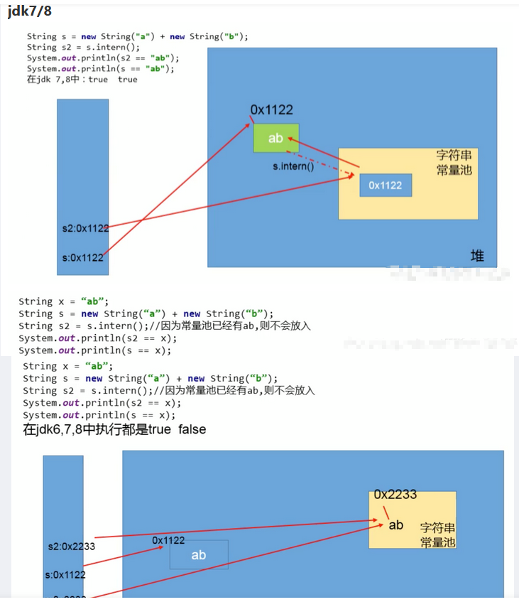

## 数据类型
| 类型  |字节|默认值|
| ----- |---|---|
| byte  | 1 | 0 |
| short | 2 | 0 |
| int   | 4 | 0 |
| long  | 8 | 0L|
| float | 4 |0.0f|
| double| 8 |0.0d|
| char  | 2 | \u0000 |
| boolean |1|false|

int 面试题
```Java
public class IntegerTest {
  public static void main(String[] args) {
    Integer f1 = 100, f2 = 100, f3 = 140, f4 = 140;
    System.out.println(f1 == f2);
    System.out.println(f3 == f4);
  }
}
```
::: tip
当 int 数据类型 数值范围是<font color="orange"> -128-127 </font>之间，integer是不会创建新的变量会直接用已经缓存的，超过此范围才会使用新的。  
所以上面的 f1 == f2 true  f3 == f4 false
:::

## 面向对象
`方法重载`满足条件：
- 方法名必须相同 `必要条件`
- 参数列表不同（参数个数、类型、参数排列顺序）`必要条件`
- 方法返回类型可以相同也可以不相同
- 重载发生在编译时，因为编译器可以根据参数的类型来选择使用哪个方法

`方法重写`满足条件：
- 必须存在子父类继承关系 `必要条件`
- 重写的方法必须要和父类保持一致，包括**返回值类型、方法名、参数列表**也都是一样
- 子类中重写方法的访问权限不能低于分类中方法的访问权限

::: tip
构造器（constructor）是否可被重写（override）?  
答：构造器不能被继承，因此不能被重写，但可以被重载。
:::

`初始化顺序`：
- 静态属性初始化
- 静态方法块初始化
- 普通属性初始化
- 普通方法块初始化
- 构造函数初始化

`this 和 super`：  
**this**：表示当前对象，this可以调用方法、属性和*指向对象本身*。  
**super**：表示父类对象，super可以调用父类的方法、属性。

`继承`：继承是所有oop语言和Java语言不可或缺的一部分。只要我们创建了一个类它就默认继承自**Object**父类。如果你指定了其他的父类，那就是你指定的父类继承自**Object**。
继承关键字：**extends**

`多态`：多态是指同一个行为具有多个不同的表现形式。是指一个实例（对象）的相同方法在不同情形下具有不同表现形式。封装和继承是多态的基础。  
**多态满足条件：**
- 继承
- 重写父类方法
- 父类引用指向子类对象

向上转型：通过子类对象转化为父类对象，自动完成，不用强制。  
向下转型：通过父类对象转化为子类对象，不是自定完成，需要强制转换。

`组合`：多用组合，少用继承

**组合和继承区别**
| 特征  | 组合  | 继承 |
| --- | --- | --- |
|关系|组合是has-a关系，可以理解为有一个|继承是is-a关系，可以理解为是一个|
|耦合性|组合双方是一种松耦合关系|继承双方是紧耦合|
|是否具有多态|否|是|
|时期|组合是运行期绑定|继承是编译期绑定|

`static`：Java中的关键字，意思是静态的，可以修饰成员变量和方法，被修饰的方法和变量可以直接在没有创建对象的时候用**类名.属性/方法**访问

`final`：可以修饰类、属性、方法
- final修饰类时，类不可被继承。final类中成员变量可以根据需要设置为final，但是要注意所有成员方法会被隐式的指定为final方法。
- final修饰方法时，表示此方法不可被任何子类重写
- final修饰变量有俩种情况：修饰基本数据类型，表示数值不可修改；修饰引用数据类型，表示对象初始化后不能再指向其他的对象。

## 接口和抽象类
`接口特征`
- 一个完全抽象的类，不会有任何方法的实现，只可以定义。
- 接口中只有俩种访问修饰符，一种是<font color="orange">public</font>，对整个项目可见，一种是<font color="orange">default</font>缺省，具有包访问权限。
- 接口只提供方法的定义，接口没有实现，但是可以被其他的类用关键字<font color="orange">implements</font>实现。
- 接口不能被实例化，不可以有构造方法。
- 接口必须实现接口的所有方法，否则必须定义为<font color="orange">抽象类</font>
::: tip
注：JDK 1.8 以后，接口里可以有静态方法和方法体了。  
注：JDK 1.8 以后，接口允许包含具体实现的方法，该方法称为"默认方法"，默认方法使用 default 关键字修饰。更多内容可参考 Java 8 默认方法。  
注：JDK 1.9 以后，允许将方法定义为 private，使得某些复用的代码不会把方法暴露出去。更多内容可参考 Java 9 私有接口方法。  
:::

`抽象类`：抽象类是一种抽象能力弱于接口的类，在Java中，抽象类使用<font color="orange">abstract</font>关键字来表示。如果把接口形容为狗这个物种，那么抽象类可以说是毛发是白色、小体的品种，而实现类可以是具体的类，比如说是博美、泰迪等。你可以像下面这样定义抽象类
**特征**
- 如果一个类中有抽象方法，那么这个类一定是抽象类。
- 抽象类不一定有抽象方法，抽象类也可以有普通方法。
- 抽象类中可以定义**构造方法、抽象方法、普通方法、方法、静态属性和静态方法**。
- 抽象类和接口一样不能被实例化，实例化只能实例化具体的类。

## 谈谈你对Java的理解
- 首先是一种面向对象的语言，语言特性有封装，继承，多态
- 支持跨平台，一次书写到处运行
- 垃圾回收器(GC)，程序员不用关注内存的分配和回收

## == 和 equals的区别
::: tip
== 运算符
- 可以使用在基本数据类型变量和引用数据类型变量中
- 如果比较的是基本数据类型变量：比较两个变量保存的数据是否相等。(不一定类型要相同)
- 如果比较的是引用数据类型变量：比较两个对象的地址值是否相同,即两个引用是否指向同一个对象实体  
`== 符号使用时，必须保证符号左右两边的变量类型一致。`

equals()方法的使用
- 是一个方法，而非运算符
- 只能适用于引用数据类型。
```java
  // Object类中equals()的定义：
  public boolean equals(Object obj) {
    return (this == obj);
  }
```
`Object类中定义的equals()和==的作用是相同的，比较两个对象的地址值是否相同，即两个引用是否指向同一个对象实体。`
- 像String、Date、File、包装类等都重写了Object类中的equals()方法.  
两个引用的地址是否相同，而是比较两个对象的“实体内容”是否相同。

- 通常情况下，我们自定义的类如果使用equals()的话，也通常是比较两个对象的"实体内容"是否相同。  
那么，我们就需要对Object类中的equals()进行重写。

`重写的原则:比较两个对象的实体内容是否相同。`
:::

## a = a + b 与 a += b 的区别
::: tip
+= 隐式的将加操作的结果类型强制转换为持有结果的类型。如果两这个整型相加，如 byte、short 或者 int，首先会将它们提升到 int 类型，然后在执行加法操作。如果加法操作的结果比 a 的最大值要大，则 a+b 会出现编译错误，但是a += b 没问题
```java
byte a = 127;
byte b = 127; b = a + b; // error : cannot convert from int to byte
b += a;// ok
```
:::

## 自增变量面试题解析
```java
public static void main(String[] args) {
  // 局部变了表 i=1
  int i = 1;
  // 把i压入操作数栈 局部变量表 i=1 操作数栈 1
  // 执行i++ i自增 局部变量表i=2 操作数栈 1
  // 执行=赋值操作 将 操作数栈 1 转移到 局部变量表 i  i 就被 覆盖成 i=1
  // 结果：i=1
  i = i++; 
  // 把i压入操作数栈 操作数栈 1
  // 执行i++ 局部变量表i自增 i=2 操作数栈 1
  // 执行=赋值操作 将 操作数栈 1 转移到 局部变量表 j 所以j=1 i没有被覆盖 局部变量表 i=2
  // 结果：i=2 j=1
  int j = i++;
  // 把i压入操作数栈 局部变量表 i=2 j=1 k=0 操作数栈 2
  // 执行++i （先自增后入栈 所以目前栈顶部是 3） 局部变量表 i=3 j=1 k=0 操作数栈  3 2 俩个数值 （2在下面）
  // 执行i++ （先入栈后自增 所以目前栈顶部还是 3） 局部变量表 i=4 j=1 k=0 操作数栈  3 3 2 三个数值 （2在下面）
  // 计算乘法 （3*3算后因为没办法赋值给指定变量 所以又入栈了）局部变量表 i=4 j=1 k=0 操作数栈  9（3*3） 2 俩个数值 （2在下面）
  // 计算加法  局部变量表 i=4 j=1 k=0 操作数栈  11（9+2） 一个数值
  // 执行=赋值操作 操作数栈 11 赋值给 k 最终 局部变量表 i=4 j=1 k=11
  int k = i + ++i * i++;
  System.out.println("i=" + i); // 4
  System.out.println("j=" + j); // 1
  System.out.println("k=" + k); // 11
}
```
::: tip
++ 操作符不需要在操作数栈计算 是直接在局部变量表执行  
- ++在前 先自增后入操作数栈
- ++在后 先入操作数栈后自增
:::

## 当一个对象被当做参数传递给一个方法，此方法可以改变这个对象的属性，并返回变化后的结果，那么这里到底是值传递还是引用传递？
::: tip
值传递。  
Java没有引用传递，都是值传递。  
只不过引用类型传的是地址值，基本类型是数值。    
如果参数是基本数据类型，此时实参赋值给形参的是实参真实存储的数据值。    
如果参数是引用数据类型，此时实参赋值给形参的是实参存储数据的地址值。
:::

## 值传递和引用传递面试题
```java
/**
 * 具体的内存流程解析：
 * 1.main方法进栈
 * 1.1局部变量表声明i基本数据类型 并 赋值 1
 * 1.2局部变量表声明str对象 指向堆内存中的 字符串常量池的指定地址 jdk1.7
 * 1.3局部变量表声明num对象 （范围不在-128-127之间，不用缓存）直接在堆中开辟对象存储
 * 1.4局部变量表声明arr对象 堆中开辟空间存储一个长度4位的数组对象并给对于的每个下标赋值
 * 1.5局部变量表声明MyData对象 堆中开辟空间存储对象 并且有个属性i=10
 * 2.change方法进栈（main方法在栈底 change在其上）
 * 2.1将i的值传递给j j=1；
 *    str的地址值传递给s s和str共同指向堆内存常量池的 hello；
 *    num的地址值传递给n n和num共同指向堆内存200的地址；
 *    arr的地址值传递给a a和arr共同指向{1, 2, 3, 4}堆内存地址
 *    myData的地址值传递给md md和myData共同指向myData堆内存地址
 * 2.2 j += 1;----> change栈帧中的j改为2
 * 2.3 s += "world";----> String是特殊的引用类型
 *     先在堆中的常量池查找world 没有就新建 然后再拼接后找hello world 没有新建返回新的地址值给s
 *     原本s=hello时和main方法的str共同指向对空间字符串常量池的hello地址
 *     此时因为拼接了world形成新的对象引用，s地址值和str就不一样了 str并没有改变
 * 2.4 n += 1;----> 包装类是特殊的引用类型和String一样不可变 改变其值只能在堆新开辟一个新的
 *     所以change栈中的n和main栈中的num又不是一个堆中的地址值 main中的num地址不变
 * 2.5 a[0] += 1; md.a = 1; ----> 此俩步都是对象的引用 改变的是对象中的某个属性 并未改变地址
 *     此时change和main地址值都一样 但内部的属性都已变
 * 2.6 md.a = 1; 执行完了就弹栈了 此时  int j, String s, Integer n, int[] a, MyData md 都消失了
 * 最终结果 1 hello 200 {2, 2, 3, 4} 1
 **/
public class ValuePassedTest {
  public static void main(String[] args) {
    int i = 1;
    String str = "hello";
    Integer num = 2;
    int[] arr = {1, 2, 3, 4};
    MyData myData = new MyData();
    // 改变值
    change(i, str, num, arr, myData);
    System.out.println("i=" + i); // 1
    System.out.println("str=" + str); // hello
    System.out.println("num=" + num); // 2
    System.out.println("arr=" + Arrays.toString(arr)); // [2, 2, 3, 4]
    System.out.println("myData.a=" + myData.a); // 1
  }
  private static void change(int j, String s, Integer n, int[] a, MyData md) {
    j = j + 1;
    s = s + "world";
    n = n + 1;
    a[0] = a[0] + 1;
    md.a = 1;
  }
}
class MyData {
  int a = 10;
}
```
::: tip
- String 和 包装类 不可变性
- 值传递和引用传递  
`如果参数是基本数据类型，此时实参赋值给形参的是实参真实存储的数据值。`   
`如果参数是引用数据类型，此时实参赋值给形参的是实参存储数据的地址值。`
:::

## 重载（Overload）和重写（Override）的区别。重载的方法能否根据返回类型进行区分？
::: tip
方法的重载和重写都是实现多态的方式，区别在于前者实现的是编译时的多态性，而后者实现的是运行时的多态性。  
重载发生在一个类中，同名的方法如果有不同的参数列表（参数类型不同、参数个数不同或者二者都不同）则视为重载；  
重写发生在子类与父类之间，重写要求子类被重写方法与父类被重写方法有相同的返回类型，比父类被重写方法更好访问，不能比父类被重写方法声明更多的异常（里氏代换原则）。  
重载对返回类型没有特殊的要求。
:::

## 抽象类（abstract class）和接口（interface）有什么异同？
::: tip
抽象类和接口都不能够实例化，但可以定义抽象类和接口类型的引用。  
一个类如果继承了某个抽象类或者实现了某个接口都需要对其中的抽象方法全部进行实现，否则该类仍然需要被声明为抽象类。  
接口比抽象类更加抽象，因为抽象类中可以定义构造器，可以有抽象方法和具体方法，而接口中不能定义构造器而且其中的方法全部都是抽象方法。 
抽象类中的成员可以是 private、默认、protected、public 的，而接口中的成员全都是 public 的。抽象类中可以定义成员变量，而接口中定义的成员变量实际上都是常量。有抽象方法的类必须被声明为抽象类，而抽象类未必要有抽象方法。
:::

## 抽象的（abstract）方法是否可同时是静态的（static）,是否可同时是本地方法（native），是否可同时被 synchronized修饰？
::: tip
都不能。  
抽象方法需要子类重写，而静态的方法是无法被重写的，因此二者是矛盾的。本地方法是由本地代码（如 C 代码）实现的方法，而抽象方法是没有实现的，也是矛盾的。synchronized 和方法的实现细节有关，抽象方法不涉及实现细节，因此也是相互矛盾的。
:::

## 静态变量和实例变量的区别
::: tip
静态变量是被 static 修饰符修饰的变量，也称为类变量，它属于类，不属于类的任何一个对象，一个类不管创建多少个对象，静态变量在内存中有且仅有一个拷贝；实例变量必须依存于某一实例，需要先创建对象然后通过对象才能访问到它。静态变量可以实现让多个对象共享内存。  
补充：在 Java 开发中，上下文类和工具类中通常会有大量的静态成员。
:::

## 是否可以从一个静态（static）方法内部发出对非静态（non-static）方法的调用？
::: tip
不可以，静态方法只能访问静态成员，因为非静态方法的调用要先创建对象，在调用静态方法时可能对象并没有被初始化。
:::

## 如何实现对象克隆？
::: tip
- 实现 Cloneable 接口并重写 Object 类中的 clone()方法。
- 实现 Serializable 接口，通过对象的序列化和反序列化实现克隆，可以实现真正的深度克隆。
:::

## 接口是否可继承（extends）接口？抽象类是否可实现（implements）接口？抽象类是否可继承具体类（concreteclass）？
::: tip
接口可以继承接口，而且支持多重继承。抽象类可以实现(implements)接口，抽象类可继承具体类也可以继承抽象类。
:::

## 阐述 final、finally、finalize 的区别
::: tip
- final：修饰符（关键字）有三种用法：如果一个类被声明为 final，意味着它不能再派生出新的子类，即不能被继承，因此它和 abstract 是反义词。将变量声明为 final，可以保证它们在使用中不被改变，被声明为 final 的变量必须在声明时给定初值，而在以后的引用中只能读取不可修改。被声明为 final 的方法也同样只能使用，不能在子类中被重写。
- finally：通常放在 try…catch…的后面构造总是执行代码块，这就意味着程序无论正常执行还是发生异常，这里的代码只要 JVM 不关闭都能执行，可以将释放外部资源的代码写在 finally 块中。
- finalize：Object 类中定义的方法，Java 中允许使用 finalize()方法在垃圾收集器将对象从内存中清除出去之前做必要的清理工作。这个方法是由垃圾收集器在销毁对象时调用的，通过重写 finalize()方法可以整理系统资源或者执行其他清理工作。
:::

## 为什么匿名内部类和局部内部类只能访问局部final变量？
**首先内部类和外部类是处于同一个级别的，内部类不会因为定义在方法中就会随着方法的执行完毕就被销毁。**  
当外部类的方法结束时，局部变量就会被销毁了，但是内部类对象可能还存在(只有没有人再引用它时，才会死亡)。  
这里就出现了一个矛盾：内部类对象访问了一个不存在的变量。  
为了解决这个问题，就将局部变量复制了一份作为内部类的成员变量，这样当局部变量死亡后，内部类仍可以访问它，实际访问的是局部变量的"copy"。这样就好像延长了局部变量的生命周期。

## String 基础知识
- String 是不可变的、不可被继承 源码声明是final 部分源码：
```java
/** jdk1.8 */
public final class String
  implements java.io.Serializable, Comparable<String>, CharSequence {
  /** The value is used for character storage. */
  private final char value[];
  /** Cache the hash code for the string */
  private int hash; // Default to 0
  /** use serialVersionUID from JDK 1.0.2 for interoperability */
  private static final long serialVersionUID = -6849794470754667710L;
}
```
```java
/** jdk9 开始 */
public final class String
  implements java.io.Serializable, Comparable<String>, CharSequence {
  /**
    * The value is used for character storage.
    * @implNote This field is trusted by the VM, and is a subject to
    * constant folding if String instance is constant. Overwriting this
    * field after construction will cause problems.
    * Additionally, it is marked with {@link Stable} to trust the contents
    * of the array. No other facility in JDK provides this functionality (yet).
    * {@link Stable} is safe here, because value is never null.
    */
  @Stable
  private final byte[] value;
  /**
    * The identifier of the encoding used to encode the bytes in
    * {@code value}. The supported values in this implementation are
    * LATIN1
    * UTF16
    * @implNote This field is trusted by the VM, and is a subject to
    * constant folding if String instance is constant. Overwriting this
    * field after construction will cause problems.
    */
  private final byte coder;
  /** Cache the hash code for the string */
  private int hash; // Default to 0
  /** use serialVersionUID from JDK 1.0.2 for interoperability */
  private static final long serialVersionUID = -6849794470754667710L;
}
```
::: tip
- String 字符在 `jdk1.8 `是用char数组声明的但是到了 `jdk9` 开始后用了byte数组声明  
`原因在于`：因为char是占用2个字节,byte占用1个字节,但是大部分字符都是 LATIN1 (中文占用2个LATIN1)导致很多的内存空间浪费.
- 通过字面量的方式（区别于new）给一个字符串赋值，此时的字符串值声明在字符串常量池中 不在 堆中
- 通过new的方式声明String，此时堆中会有一个对象指向常量池
- 字符串常量池中是不会存储相同内容的字符串的
- String的String Pool是一个固定大小的Hashtable,默认值大小长度是1009。  
`如果放进StringPool的String非常多,就会造成Hash冲突严重,从而导致链表会很长,`   
`而链表长了后直接会造成的影响就是当调用String.intern时性能会大幅下降。`  
`使用 -XX:StringTableSize可设置StringTable的长度.`
- **jdk6**: StringTable是固定的,就是1009的长度,所以如果常量池中的字符串过多就会导致效率下降很快。StringTableSize设置没有要求 
- **jdk7**: StringTable的长度默认值是60013 
- **jdk8**: 1009是StringTable长度可设置的最小值!
:::

## String str1 = "abc"; 与String str2 = new String("abc");的区别？
::: tip
- String str1 = "abc";
`str1`>>> 直接指向常量池中的字符串`"abc"`，如果常量池不存在先创建
- String str2 = new String("abc");
`str2`>>> 如果字符串常量池中有`str2`，则并不会放入，返回已有的串池中的对象的地址；如果没有，它不会创建一个对象，如果堆中已经这个字符串，那么会将堆中的引用地址赋给它
:::


## new String(“ab”)会创建几个对象？String str1 = new String("a") + new String("b");会创建几个？
```java
public class StringNew {
  public static void main(String[] args) {
    //创建了俩个对象
    //1.new 关键字 在堆中创建一个对象
    //2.字符串"ab"加入常量池 对应字节码指令 ldc
    String str = new String("ab");
    //创建了5个对象 严格来说是 6个
    //1.new StringBuilder
    //2.堆 new
    //3.ldc 常量池 "a"
    //4.堆 new
    //5.ldc 常量池 "b"
    //==============================
    //第6个对象其实是StringBuilder内部的toString()方法内的new String()
    //*****注意：强调一下，toString()的调用，在字符串常量池中，没有生成"ab" 没有ldc指令
    String str1 = new String("a") + new String("b");
  }
}
```
`new String("abc")` 字节码 和 `new String("a") + new String("b")` 字节码  


## String不同拼接操作的对比
```java
public class StringTest {
  public static void main(String[] args) {
    //编译期优化
    test01();
    //大杂烩
    test02();
    //俩个String变量相加执行细节 重点
    test03();
    test04();
  }

  private static void test01() {
    //编译期优化：等同于"abc" 在字节码文件中,s1="abc"
    String s1 = "a" + "b" + "c";
    //"abc"一定是放在字符串常量池中，将此地址赋给s2
    String s2 = "abc";
    /**
     * 最终.java编译成.class,再执行.class
     * String s1 = "abc";
     * String s2 = "abc"
     */
    //true
    System.out.println(s1 == s2);
    //true
    System.out.println(s1.equals(s2));
  }

  private static void test02() {
    String s1 = "javaEE";
    String s2 = "hadoop";

    String s3 = "javaEEhadoop";
    //编译期优化
    String s4 = "javaEE" + "hadoop";
    //如果拼接符号的前后出现了变量，则相当于在堆空间中new String()，具体的内容为拼接的结果：javaEEhadoop
    String s5 = s1 + "hadoop";
    String s6 = "javaEE" + s2;
    String s7 = s1 + s2;
    //true
    System.out.println(s3 == s4);
    //下面全是false
    System.out.println(s3 == s5);
    System.out.println(s3 == s6);
    System.out.println(s3 == s7);
    System.out.println(s5 == s6);
    System.out.println(s5 == s7);
    System.out.println(s6 == s7);
    //intern():判断字符串常量池中是否存在javaEEhadoop值，如果存在，则返回常量池中javaEEhadoop的地址；
    //如果字符串常量池中不存在javaEEhadoop，则在常量池中加载一份javaEEhadoop，并返回次对象的地址。
    String s8 = s6.intern();
    //true
    System.out.println(s3 == s8);
  }

  private static void test03() {
    String s1 = "a";
    String s2 = "b";
    String s3 = "ab";
    /*
    如下的s1 + s2 的执行细节：(变量s是我临时定义的）
    ① StringBuilder s = new StringBuilder();
    ② s.append("a")
    ③ s.append("b")
    ④ s.toString()  --> 约等于 new String("ab")
    补充：在jdk5.0之后使用的是StringBuilder,
         在jdk5.0之前使用的是StringBuffer
      */
    String s4 = s1 + s2;
    System.out.println(s3 == s4);//false
  }
  
  /**
   * 1.字符串拼接操作不一定使用的是StringBuilder!
   *   如果拼接符号左右两边都是字符串常量或常量引用，则仍然使用编译期优化，即非StringBuilder的方式。
   * 2.针对于final修饰类、方法、基本数据类型、引用数据类型的量的结构时，能使用上final的时候建议使用上。
   */
  private static void test04() {
    //final修饰后其实就是等价于 String s4 = "a" + "b";
    final String s1 = "a";
    final String s2 = "b";
    String s3 = "ab";
    String s4 = s1 + s2;
    //true
    System.out.println(s3 == s4);
  }
}
```

`test03` 方法字节码  

`test04` 方法字节码    


::: tip
- 常量与常量的拼接结果在常量池,原理是编译期优化,且常量池中不会存在相同内容的常量。
- 只要其中有一个是变量，结果就在堆中  
`(只有有一个是变量,那么它会在堆中创建一个StringBuilder,调用append()方法进行添加操作，调用toString()方法转换为字符串【toString()方法其实就是:new String()】)`
- 如果拼接的结果调用intern()方法，不同jdk操作不同  
**JDK1.6**:  
`如果字符串常量池中有，则并不会放入。返回已有的串池中的对象的地址`  
`如果没有,它会在常量池中创建一个对象放入串池中，并返回串池中的对象地址`  
**JDK1.7之后**:  
`如果字符串常量池中有，则并不会放入。返回已有的串池中的对象的地址`  
`如果没有，它也不会在字符串常量池创建此对象，会去堆中找此字符串对象，如果有就返回堆的地址，并且字符串常量池此对象会指向堆的地址；如果堆中有，那么会将堆中的引用地址赋给它`
:::

## String intern()方法的使用
::: tip
- 如果不是用双引号声明的String对象,可以使用String提供的intern方法: intern方法会从字符串常量池中查询当前字符串是否存在，若不存在就会将当前字符串放入常量池中
`比如: String myInfo = new String("aaa").intern();`  
`也就是说,如果在任意字符串上调用String.intern方法,那么其返回结果所指向的那个类实例,必须和直接以常量形式出现的字符串实例完全相同。`  
`因此,下列表达式的值必定是true：("a" + "b" + "c").intern() == "abc";`  
`通俗点讲,Interned String就是确保字符串在内存里只有一份拷贝,这样可以节约内存空间,加快字符串操作任务的执行速度。`  
`注意,这个值会被存放在字符串内部池（String Intern Pool）`
:::

## String.intern()的面试题
```java
/**
 * 如何保证变量s指向的是字符串常量池中的数据呢？
 * 有两种方式：
 * 方式一： String s = "smyxcoding";//字面量定义的方式
 * 方式二： 调用intern()
 *         String s = new String("smyxcoding").intern();
 *         String s = new StringBuilder("smyxcoding").toString().intern();
 *  */
public class StringIntern {
  public static void main(String[] args) {
    String s = new String("1");
    String s1 = s.intern();//调用此方法之前，字符串常量池中已经存在了"1"
    String s2 = "1";
    //s  指向堆空间"1"的内存地址
    //s1 指向字符串常量池中"1"的内存地址
    //s2 指向字符串常量池已存在的"1"的内存地址  所以 s1==s2
    System.out.println(s == s2);//jdk6：false   jdk7/8：false
    System.out.println(s1 == s2);//jdk6: true   jdk7/8：true
    System.out.println(System.identityHashCode(s));//491044090
    System.out.println(System.identityHashCode(s1));//644117698
    System.out.println(System.identityHashCode(s2));//644117698

    //s3变量记录的地址是堆内存中的地址
    String s3 = new String("1") + new String("1");
    //执行完上一行代码以后，字符串常量池中，是否存在"11"呢？
    //答案：不存在！！原因是StringBuilder的toString方法字节码中不存在ldc命令

    //在字符串常量池中生成"11"。
    //如何理解？
    //jdk6:创建了一个新的对象"11",也就有新的地址。
    //jdk7/8:此时常量中并没有创建"11",而是创建了一个从常量池指向堆空间中new String("11")的地址 所以 s3 = s4
    //jdk7/8常量池在堆空间 这么做是为了节约空间）
    s3.intern();
    //s4变量记录的地址：使用的是上一行代码代码执行时，在常量池中生成的"11"的地址
    String s4 = "11";
    System.out.println(s3 == s4);//jdk6：false  jdk7/8：true
  }
}
```


```java
public class StringExer1 {
  public static void main(String[] args) {
    // 此步骤执行完常量池没有 "ab"
    // 操作步骤：
    // 1.new StringBuilder() 2.new String() 3.将 "a" 放进字符串常量池(ldc)
    // 4.new String() 5.将 "b" 放进字符串常量池(ldc)
    // 6.StringBuilder调用自己的toString()方法生成字符串"ab"返回给 s
    // 为什么字符串常量池不存在 "ab"？
    // 因为StringBuilder调用自己的toString()方法 字节码中并没有ldc命令
    // 所以这行代码相当于生成6个对象 并且 只有 "a" "b" 在 字符串常量池
    String s = new String("a") + new String ("b");
    // 此行代码相当于在常量池创建了一个引用类型变量指向了堆中的"ab"的地址 所以 s == s1 为true
    String s2 = s.intern();
    System.out.println(s == s2); // true
    System.out.println(s2 == "ab"); // true
    System.out.println(s == "ab"); // true
  }
}
```



## intern()效率测试
```java
/**
 * 使用intern()测试执行效率：空间使用上
 * 结论：对于程序中大量存在存在的字符串，尤其其中存在很多重复字符串时，使用intern()可以节省内存空间。
 **/
public class StringIntern2 {
  static final int MAX_COUNT = 1000 * 10000;
  static final String[] arr = new String[MAX_COUNT];

  public static void main(String[] args) {
    Integer[] data = new Integer[]{1,2,3,4,5,6,7,8,9,10};

    long start = System.currentTimeMillis();
    for (int i = 0; i < MAX_COUNT; i++) {
        //  arr[i] = new String(String.valueOf(data[i % data.length]));
        arr[i] = new String(String.valueOf(data[i % data.length])).intern();
    }
    long end = System.currentTimeMillis();
    System.out.println("花费的时间为：" + (end - start));
    try {
        Thread.sleep(1000000);
    } catch (InterruptedException e) {
        e.printStackTrace();
    }
    System.gc();
  }
}
```

## StringBuffer和StringBuilder的介绍
::: tip
- String:不可变的字符序列；底层使用`char[]` `byte[]`存储
- StringBuffer:可变的字符序列；线程安全的，效率低；底层使用`char[]` `byte[]`存储
- StringBuilder:可变的字符序列；jdk5.0新增的，线程不安全的，效率高；底层使用`char[]` `byte[]`存储
- StringBuffer StringBuilder 默认程度是16位`char[]` `byte[]`数组 `扩容规则`： 2倍+2 如果还不够直接用字符串长度。
::: 
