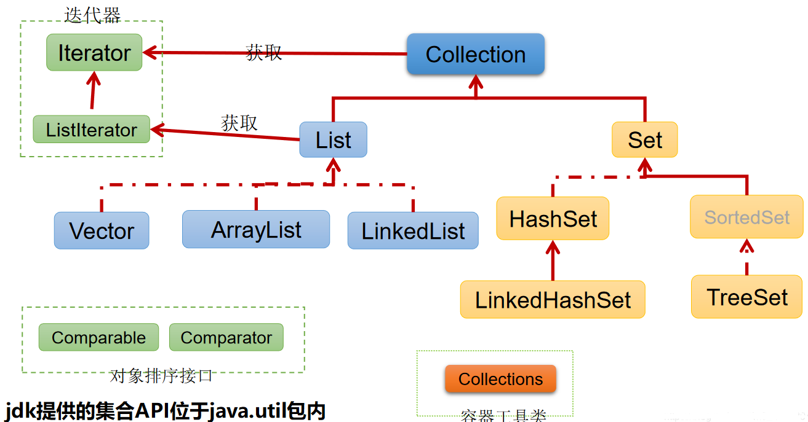
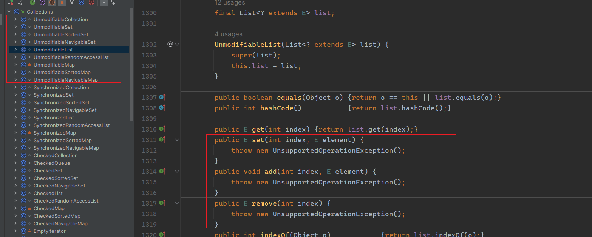

# 基础简介


## Collection接口 之 List
- Collection接口：单列集合，用来存储一个一个对象。  
    - List接口：有序，可重复
      - ArrayList、LinkedList、Vector
    - Set接口：无序，不可重复 
      - HashSet、LinkedHashSet、TreeSet

::: tip
Set接口中没有定义额外的方法，使用的都是Collection中声明过的方法。  
有序、无序：指的是存储数据在底层数组中并非按照索引的顺序添加，而是根据数据的哈希值决定。  
不可重复：保证添加元素按照equals()判断时，不能返回true。即：相同的元素只能添加一个。
:::

## ArrayList、LinkedList、Vector 三者异同
相同：
  - 都实现了List接口，存储数据特点一样：有序，可重复
不同：
  - ArrayList 作为List接口的主要实现类；`线程不安全的，效率高`；底层使用Object[] elementData存储
  - LinkedList 对于`频繁的插入、删除操作，使用此类效率比ArrayList高`；底层使用`双向链表存储`
  - Vector 作为List接口的古老实现类；`线程安全的，效率低；`底层使用Object[] elementData存储

## HashSet、LinkedHashSet、TreeSet
- HashSet：作为Set接口的主要实现类；`线程不安全的`；可以存储null值
- LinkedHashSet：作为HashSet的子类；遍历其内部数据时，可以按照添加的顺序遍历，  
    - 对于频繁的遍历操作，`LinkedHashSet效率高于HashSet`.
- TreeSet：可以按照添加对象的指定属性，进行排序。

## ArrayList源码解析
<font color="orange">JDK1.7</font>: 
  - new ArrayList();// 底层创建了长度是10的Object[]数组elementData
  - list.add(123);// elementData[0] = new Integer(123);
  - 扩容规则：默认情况下，扩容为原来的容量的1.5倍，同时需要将原有数组中的数据复制到新的数组中。
  - 最大容量：int 最大值 - 8 （建议开发中使用带参的构造器：ArrayList list = new ArrayList(int capacity)）

<font color="orange">JDK1.8</font>:
  - new ArrayList();// 底层Object[] elementData初始化为{}.**并没有创建长度为10的数组**
  - list.add(123);// 第一次调用add()时，底层才创建了长度10的数组，并将数据123添加到elementData[0]
  - 扩容规则：默认情况下，扩容为原来的容量的1.5倍，同时需要将原有数组中的数据复制到新的数组中。
  - 最大容量：int 最大值 - 8 （建议开发中使用带参的构造器：ArrayList list = new ArrayList(int capacity)）

::: tip
jdk7中的ArrayList的对象的创建类似于单例的饿汉式，而jdk8中的ArrayList的对象的创建类似于单例的懒汉式，延迟了数组的创建，节省内存。
:::

## LinkedList源码解析
- LinkedList：双向链表，内部没有声明数组，而是定义了Node类型的first和last，用于记录首末元素。同时，定义内部类Node，作为LinkedList中保存数据的基本结构。
- 对于频繁的插入或删除元素的操作，建议使用LinkedList类，效率较高

## ArrayList与LinkedList的区别
- ArrayList的实现是基于数组来实现的，LinkedList的基于双向链表来实现。
- LinkedList比ArrayList更占内存，因为LinkedList的节点除了存储数据，还存储了两个引用，一个指向前一个元素，一个指向后一个元素。
- 对于随机访问，ArrayList要优于LinkedList。
- 对于插入和删除操作，LinkedList优于ArrayList。  

## ArrayList 与 Vector 区别呢?为什么要用Arraylist取代Vector呢？
- 线程安全：Vector 使用了 Synchronized 来实现线程同步，是线程安全的，而 ArrayList 是非线程安全的。
- 性能：ArrayList 在性能方面要优于 Vector。
- 扩容：ArrayList 和 Vector 都会根据实际的需要动态的调整容量，只不过在 Vector 扩容每次会增加 1 倍，而 ArrayList 只会增加 50%。

## HashSet简介
HashSet按`Hash算法`来存储集合中的元素，因此具有很好的存取、查找、删除性能。  
- `底层`是数组+链表的结构，初始容量是16
- `扩容规则`如果使用率超过0.75，（16*0.75=12）就会扩大容量为原来的2倍。（16扩容为32，依次为64,128…等）
- HashSet 集合判断两个元素相等的标准：两个对象通过hashCode() 方法比较相等，并且两个对象的equals()方法返回值也相等。  
`相等的对象必须具有相等的散列码`

## HashSet添加数据的过程
我们向HashSet中添加元素a,首先调用元素a所在类的hashCode()方法，计算元素a的哈希值，此哈希值接着通过某种算法计算出在HashSet底层数组中的存放位置（即为：索引位置），判断数组此位置上是否已经有元素：  
- 如果此位置上没有其他元素，则元素a添加<font color="green">成功</font>。 ---> `情况1`  
- 如果此位置上有其他元素b(或以链表形式存在的多个元素），则比较元素a与元素b的hash值：
    - 如果hash值不相同，则元素a添加<font color="green">成功</font>。---> `情况2`
    - 如果hash值相同，进而需要调用元素a所在类的equals()方法：  
        - equals()返回true,元素a添加<font color="red">失败</font>
        - equals()返回false,则元素a添加成功。---> `情况3`

::: tip
对于添加成功的情况2和情况3而言：元素a 与已经存在指定索引位置上数据以链表的方式存储。  
jdk 7 :元素a放到数组中，指向原来的元素。  
jdk 8 :原来的元素在数组中，指向元素a。  
`总结：七上八下`  
:::

## 关于hashCode()和equals()的重写
- 重写hashCode() 方法的基本原则
    - 在程序运行时，同一个对象多次调用hashCode()方法应该返回相同的值。
    - 当两个对象的equals()方法比较返回true时，这两个对象的hashCode()方法的返回值也应相等。
    - 对象中用作equals() 方法比较的Field，都应该用来计算hashCode值。
- 重写equals() 方法的基本原则
    - 当一个类有自己特有的“逻辑相等”概念,当改写equals()的时候，总是要改写hashCode()，根据一个类的equals方法（改写后），两个截然不同的实例有可能在逻辑上是相等的，但是，根据Object.hashCode()方法，它们仅仅是两个对象。
    - 因此，违反了“相等的对象必须具有相等的散列码”。
    - 结论：复写equals方法的时候一般都需要同时复写hashCode方法。通常参与计算hashCode的对象的属性也应该参与到equals()中进行计算。

::: tip
hashCode 和 equals 方法直接用 Eclipse/IDEA 生成 无需手动去写！！！
:::

## HashSet面试题
```java
public class Student {
  private String name;
  private int age;
  public Student() {
  }
  public Student(String name, int age) {
      this.name = name;
      this.age = age;
  }
  public String getName() {
      return name;
  }
  public void setName(String name) {
      this.name = name;
  }
  public int getAge() {
      return age;
  }
  public void setAge(int age) {
      this.age = age;
  }
  @Override
  public String toString() {
      return "Student{ name='" + name + '\'' + ", age=" + age + '}';
  }
  @Override
  public boolean equals(Object o) {
    if (this == o) return true;
    if (o == null || getClass() != o.getClass()) return false;
    Student student = (Student) o;
    if (age != student.age) return false;
    return Objects.equals(name, student.name);
  }
  @Override
  public int hashCode() {
    int result = name != null ? name.hashCode() : 0;
    result = 31 * result + age;
    return result;
  }
}

public class HashSetDemo {
  public static void main(String[] args) {
    Student jack = new Student("Jack", 26);
    Student bob = new Student("bob", 26);
    HashSet<Student> hashSet = new HashSet<>();
    hashSet.add(jack);
    hashSet.add(bob);
    // [Student{name='Jack', age=26}, Student{name='bob', age=26}]
    System.out.println(hashSet);
    // 此处的set只会改变set中的指定对象的属性值，并不会按照HashSet存储数据的规则重新计算存放位置 所以他占用的还是 Student{name='Jack', age=26} 的位置
    jack.setAge(18);
    // 此处remove的时候 是根据 Student{name='Jack', age=18} 这个修改后的对象通过 HashSet 计算index的 所以没有元素可以删除
    hashSet.remove(jack);
    // [Student{name='Jack', age=18}, Student{name='bob', age=26}]
    System.out.println(hashSet);
    Student jack1 = new Student("Jack", 18);
    // 此处可以添加成功的原因在于 前一个 "Jack", 18 是在改属性前添加的 index计算的是历史的 但是这个是重新计算的 所以index不一样
    hashSet.add(jack1);
    // [Student{name='Jack', age=18}, Student{name='Jack', age=18}, Student{name='bob', age=26}]
    System.out.println(hashSet);
    // 此处的可以存放成功 因为通过HashCode计算的index和 原始的Jack一样 但是他们的age不一样 前一个jack已经改为了 18 当然他俩会放在一起
    Student jack2 = new Student("Jack", 26);
    hashSet.add(jack2);
    // [Student{name='Jack', age=18}, Student{name='bob', age=26}, Student{name='Jack', age=26}]
    System.out.println(hashSet);
  }
}
```

## 如果确保集合不能被修改
利用Collections包下的工具类  
