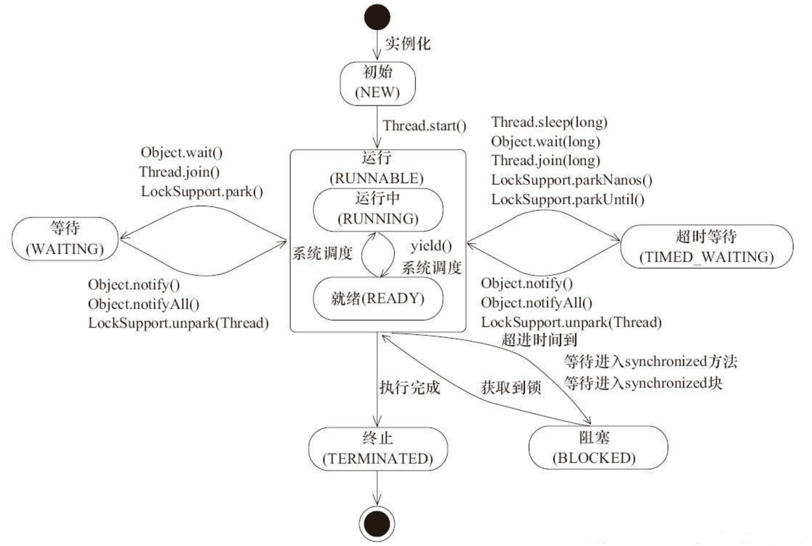

## 基本概念
**程序(program)**：为完成特定任务、用某种语言编写的一组指令的集合。  
**进程(process)**：是系统进行资源分配和调度的基本单位，是操作系统结构的基础。进程是线程的容器。程序是指令、数据及其组织形式的 描述，进程是程序的实体。  
**线程(thread)**：线程（thread） 是操作系统能够进行运算调度的最小单位。它被包含在进程之中，是进程中的实际运作单位。
  `Java默认有俩个线程 main线程 gc线程`
  - 若一个进程同一时间并行执行多个线程，就是支持多线程的
  - 线程是调度和执行的单位，每个线程拥有独立的运行栈和程序计数器(pc)，线程切换的开销小
  - 一个进程中的多个线程共享相同的内存单元/内存地址空间—》它们从同一堆中分配对象，可以访问相同的变量和对象。这就使得线程间通信更简便、高效。但多个线程操作共享的系统资源可能就会带来安全的隐患

::: tip
1.进程是操作系统资源分配的基本单位，而线程是任务调度和执行的基本单位  
2.每个进程都有独立的代码和数据空间（程序上下文），程序之间的切换会有较大的开销；线程可以看做轻量级的进程，同一类线程共享代码和数据空间，每个线程都有自己独立的运行栈和程序计数器（PC），线程之间切换的开销小  
3.在操作系统中能同时运行多个进程（程序）；而在同一个进程（程序）中有多个线程同时执行（通过CPU调度，在每个时间片中只有一个线程执行）  
4.系统在运行的时候会为每个进程分配不同的内存空间；而对线程而言，除了CPU外，系统不会为线程分配内存（线程所使用的资源来自其所属进程的资源），线程组之间只能共享资源  
5.没有线程的进程可以看做是单线程的，如果一个进程内有多个线程，则执行过程不是一条线的，而是多条线（线程）共同完成的；线程是进程的一部分，所以线程也被称为轻权进程或者轻量级进程
:::

## 并行与并发
**并行**：多个CPU同时执行多个任务。比如：多个人同时做不同的事。  
**并发**：一个CPU(采用时间片)同时执行多个任务。比如：秒杀、多个人做同一件事。

## 线程的生命周期
- **新建（NEW）**：新创建了一个线程对象，但还没有调用start()方法。
- **运行（RUNNABLE）**：Java线程中将就绪（ready）和运行中（running）两种状态笼统的称为“运行”。
  - 线程对象创建后，其他线程(比如main线程）调用了该对象的start()方法。该状态的线程位于可运行线程池中，等待被线程调度选中，获取CPU的使用权，此时处于就绪状态（ready）。
  - 就绪状态的线程在获得CPU时间片后变为运行中状态（running）。
- **阻塞（BLOCKED）**：表示线程阻塞于锁。
- **等待（WAITING）**：进入该状态的线程需要等待其他线程做出一些特定动作（通知或中断）。
- **超时等待（TIMED_WAITING**）：该状态不同于WAITING，它可以在指定的时间后自行返回。
- **终止（TERMINATED）**：表示该线程已经执行完毕。



## 线程的生命周期详解
- **1.初始状态(NEW)**：得到一个线程类，new一个实例出来，线程就进入了初始状态。
- **2.就绪状态(RUNNABLE之READY)**：
  - 就绪状态只是说你资格运行，调度程序没有挑选到你，你就永远是就绪状态。
  - 调用线程的start()方法，此线程进入就绪状态。
  - 当前线程sleep()方法结束，其他线程join()结束，等待用户输入完毕，某个线程拿到对象锁，这些线程也将进入就绪状态。
  - 当前线程时间片用完了，调用当前线程的yield()方法，当前线程进入就绪状态。
  - 锁池里的线程拿到对象锁后，进入就绪状态。
- **3.运行中状态(RUNNABLE之RUNNING)**：线程调度程序从可运行池中选择一个线程作为当前线程时线程所处的状态。**这也是线程进入运行状态的唯一的一种方式。**
- **4.等待(WAITING)**：处于这种状态的线程不会被分配CPU执行时间，它们要等待被显式地唤醒，否则会处于无限期等待的状态。
- **5.超时等待(TIMED_WAITING)**：处于这种状态的线程不会被分配CPU执行时间，不过无须无限期等待被其他线程显示地唤醒，在达到一定时间后它们会自动唤醒。
- **6.终止状态(TERMINATED)**：
  - 当线程的run()方法完成时，或者主线程的main()方法完成时，我们就认为它终止了。这个线程对象也许是活的，但是它已经不是一个单独执行的线程。线程一旦终止了，就不能复生。
  - 在一个终止的线程上调用start()方法，会抛出java.lang.IllegalThreadStateException异常。

## 线程通信方式
- 1.共享内存：线程之间共享程序的公共状态，线程之间通过读-写内存中的公共状态来隐式通信。   
`volatile共享内存`
- 2.消息传递：线程之间没有公共的状态，线程之间必须通过明确的发送信息来显示的进行通信。
`wait/notify等待通知方式 join方式`
- 3.管道流

## 创建线程的俩种方式（JDK1.5）
- 1.继承Thread类，重写run方法，调用Thread的start()方法启动线程
- 2.实现Runnable接口，重写run方法，new Thread()对象把实现Runnable接口类放进线程，调用Thread的start()方法启动线程
```java
public class ThreadTest {
  public static void main(String[] args) {
    // 方式一
    MyThread myThread = new MyThread();
    // myThread.run(); 这种写法就不是启动线程了 只是普通方法调用 用 Thread.currentThread().getName() 可以验证此问题
    myThread.start();
    // 方式二
    MyThreadRunnable runnable = new MyThreadRunnable();
    Thread thread = new Thread(runnable);
    thread.start();
  }
}
class MyThread extends Thread {
  @Override
  public void run() {
    System.out.println("继承Thread类方式创建线程");
  }
}
class MyThreadRunnable implements Runnable {
  @Override
  public void run() {
    System.out.println("实现Runnable接口方式创建线程");
  }
}
```

## 第三种创建线程方式 实现Callable接口
```java
/**
 * 创建多线程的方式三：实现Callable接口 ---> JDK 5.0新增
 * 如何理解实现Callable接口的方式创建多线程比实现Runnable接口创建多线程方式强大？
 *      1.call()可以有返回值的。
 *      2.call()可以抛出异常，被外面的操作捕获，获取异常的信息
 *      3.Callable是支持泛型的
 *      4.需要借助FutureTask类，比如获取返回结果
 **/
public class CallableTest {
  public static void main(String[] args) {
    // 4.创建Callable接口实现类的对象
    NewThread newThread = new NewThread();
    // 5.将此Callable接口实现类的对象作为传递到FutureTask构造器中，创建FutureTask的对象
    FutureTask<Integer> integerFutureTask = new FutureTask<>(newThread);
    // 6.将FutureTask的对象作为参数传递到Thread类的构造器中，创建Thread对象，并调用start()
    new Thread(integerFutureTask).start();
    try {
      // 7.如果有返回值就可以照此步骤获取返回值
      Integer integer = integerFutureTask.get();
      System.out.println("100以内偶数和： " + integer);
    } catch (InterruptedException | ExecutionException e) {
      throw new RuntimeException(e);
    }
  }
}
// 1.创建一个实现Callable的实现类 支持泛型
class NewThread implements Callable<Integer> {
  // 2.重写call方法 将此线程需要执行的操作声明在call()中
  @Override
  public Integer call() throws Exception {
    int sum = 0;
    for (int i = 0; i < 100; i++) {
      if (i % 2 == 0) {
        sum += i;
      }
    }
    // 3.如果没有返回值直接 返回null
    return sum;
  }
}
```

## 第四种创建线程方式 线程池
经常创建和销毁、使用量特别大的资源，比如并发情况下的线程，对性能影响很大。  
**线程池好处**  
- 提高响应速度 （减少了创建新线程的时间）
- 降低资源消耗 （重复利用线程池中线程，不需要每次都创建）
- 便于线程管理 （corePoolSize：核心池的大小 / maximumPoolSize：最大线程数 / keepAliveTime：线程没有任务时最多保持多长时间后会终止）

**Executors.newFixedThreadPool(n)**  
创建固定大小的线程池。每次提交一个任务就创建一个线程，直到线程达到线程池的最大大小。超出的线程会在队列中等待，可控制线程最大并发数。创建的线程池 corePoolSize 和 maximumPoolSize 值是相等的，使用的是 LinkedBlockingQueue 阻塞队列。执行长期的任务，性能好很多。
```java
public static ExecutorService newFixedThreadPool(int nThreads) {
  return new ThreadPoolExecutor(
    nThreads, nThreads, 0L, 
    TimeUnit.MILLISECONDS, new LinkedBlockingQueue<Runnable>()
  );
}
```
**Executors.newSingleThreadExecutor()**  
创建一个单线程的线程池，这个线程池只有一个线程在工作，也就是相当于单线程串行执行所有任务。将 corePoolSize 和 maximumPoolSize 都设置为1，使用的是 LinkedBlockingQueue 阻塞队列。适合一个任务一个任务执行的场景。
```java
public static ExecutorService newSingleThreadExecutor() {
  return new FinalizableDelegatedExecutorService(
    new ThreadPoolExecutor(1, 1,0L, TimeUnit.MILLISECONDS, 
    new LinkedBlockingQueue<Runnable>())
  );
}
```
**Executors.newCachedThreadPool()**  
创建一个可缓存线程池，如果线程池长度超过处理需要，可灵活回收空闲线程，若无可回收线程，则新建线程。将 corePoolSize 设置为0，maximumPoolSize 设置为Integer.MAX_VALUE ，使用的阻塞队列是SynchronousQueue，也就是说来了任务就创建线程运行，当线程空闲超过60秒，就销毁线程。适合执行很多短期异步的小程序或者负载较轻的服务器。
```java
public static ExecutorService newCachedThreadPool() {
  return new ThreadPoolExecutor(
    0, Integer.MAX_VALUE,60L, 
    TimeUnit.SECONDS, new SynchronousQueue<Runnable>()
  );
}
```
**Executors.newScheduledThreadPool(n)**  
创建一个定长线程池，支持定时及周期性任务执行。 
```java
public static ScheduledExecutorService newScheduledThreadPool(int corePoolSize) {
  return new ScheduledThreadPoolExecutor(corePoolSize);
}
```
**Executors.newWorkStealingPool()**  
JDK8引入，创建持有足够线程的线程池支持给定的并行度，并通过使用多个队列减少竞争。
```java
public static ExecutorService newWorkStealingPool() {
  return new ForkJoinPool(
    Runtime.getRuntime().availableProcessors(), ForkJoinPool.defaultForkJoinWorkerThreadFactory, 
    null, true
  );
}
```
::: tip
**禁止直接使用Executors创建线程池原因**
- FixedThreadPool 和 SingleThreadPool: 允许的请求队列长度为 Integer.MAX_VALUE，可能会堆积大量的请求，从而导致 OOM。
- CachedThreadPool 和 ScheduledThreadPool: 允许的创建线程数量为 Integer.MAX_VALUE，可能会创建大量的线程，从而导致 OOM。
:::

<font color=red>**推荐使用方式**</font>  

```java
/**
 * corePoolSize：核心线程数；线程池中常驻核心线程数。当提交一个任务到线程池时，线程池会创建一个线程来执行任务，
 *               即使其他空闲的基本线程能够执行新任务也会创建线程，等到需要执行的任务数大于线程池基本大小时就不再创建。
 * maximumPoolSize：最大线程数；线程池允许创建的最大线程数，此值>=1。如果队列满了，并且已创建的线程小于最大线程数，
 *                 则线程池也会创建新的线程执行任务。
 * keepAliveTime：线程空闲时间；当线程数大于核心时，此为终止前多余的空闲线程等待新任务的最长时间。
 * unit：keepAliveTime 的时间单位，可选的单位有天（DAYS）、小时（HOURS）、分钟（MINUTES）、毫秒（MILLISECONDS）、
 *       微妙（MICROSECONDS，千分之一毫秒）和纳秒（NANOSECONDS，千分之一微妙）。
 * workQueue：阻塞队列；用来储存等待执行任务的队列
 * threadFactory：线程工厂；用来生产一组相同任务的线程。主要用于设置生成的线程名词前缀、是否为守护线程以及优先级等。
 *               设置有意义的名称前缀有利于在进行虚拟机分析时，知道线程是由哪个线程工厂创建的。
 *
 * 使用开源框架guava 提供的 ThreadFactoryBuilder 可以快速给线程池里的线程设置有意义的名字，一般使用默认即可。如下：
 *      new ThreadFactoryBuilder().setNameFormat("XX-task-%d").build();
 * handler： 执行拒绝策略对象。当达到任务缓存上限时（即超过workQueue参数能存储的任务数），执行拒接策略，创建线程执行任务，
 *          当线程数量等于corePoolSize时，请求加入阻塞队列里，当队列满了时，接着创建线程，线程数等于maximumPoolSize。 
 *          当任务处理不过来的时候，线程池开始执行拒绝策略。
 * 阻塞队列：
 * ArrayBlockingQueue ：一个由数组结构组成的有界阻塞队列。
 * LinkedBlockingQueue ：一个由链表结构组成的有界阻塞队列。
 * PriorityBlockingQueue ：一个支持优先级排序的无界阻塞队列。
 * DelayQueue： 一个使用优先级队列实现的无界阻塞队列。
 * SynchronousQueue： 一个不存储元素的阻塞队列。
 * LinkedTransferQueue： 一个由链表结构组成的无界阻塞队列。
 * LinkedBlockingDeque： 一个由链表结构组成的双向阻塞队列。
 * 拒绝策略：
 * ThreadPoolExecutor.AbortPolicy: 丢弃任务并抛出RejectedExecutionException异常。 (默认)
 * ThreadPoolExecutor.DiscardPolicy：也是丢弃任务，但是不抛出异常。
 * ThreadPoolExecutor.DiscardOldestPolicy：丢弃队列最前面的任务，然后重新尝试执行任务。（重复此过程）
 * ThreadPoolExecutor.CallerRunsPolicy：由调用线程处理该任务。
 * 
 * 线程池关闭：
 * shutdown：将线程池状态置为SHUTDOWN,并不会立即停止：停止接收外部submit的任务,内部正在跑的任务和队列里等待的任务，会执行完后，才真正停止
 * shutdownNow：将线程池状态置为STOP。企图立即停止，事实上不一定：跟shutdown()一样，先停止接收外部提交的任务，忽略队列里等待的任务，
 *              尝试将正在跑的任务interrupt中断，返回未执行的任务列表。
 */
public ThreadPoolExecutor(
  int corePoolSize, int maximumPoolSize, long keepAliveTime, TimeUnit unit,
  BlockingQueue<Runnable> workQueue, ThreadFactory threadFactory, RejectedExecutionHandler handler) 
```

## 线程方法比较
- **Thread.sleep(long millis)**，一定是当前线程调用此方法，当前线程进入TIMED_WAITING状态，但不释放对象锁，millis后线程自动苏醒进入就绪状态。**作用**：给其它线程执行机会的最佳方式。
- **Thread.yield()**，一定是当前线程调用此方法，当前线程放弃获取的CPU时间片，但不释放锁资源，由运行状态变为就绪状态，让OS再次选择线程。**作用**：让相同优先级的线程轮流执行，但并不保证一定会轮流执行。实际中无法保证yield()达到让步目的，因为让步的线程还有可能被线程调度程序再次选中。Thread.yield()不会导致阻塞。该方法与sleep()类似，只是不能由用户指定暂停多长时间。
- **Thread.join()/Thread.join(long millis)**，当前线程里调用其它线程的join方法，当前线程进入WAITING/TIMED_WAITING状态，当前线程不会释放已经持有的对象锁。线程执行完毕或者millis时间到，当前线程一般情况下进入RUNNABLE状态，也有可能进入BLOCKED状态（因为join是基于wait实现的）。
- **obj.wait()**，当前线程调用对象的wait()方法，当前线程释放对象锁，进入等待队列。依靠notify()/notifyAll()唤醒或者wait(long timeout) timeout时间到自动唤醒。
- **obj.notify()**，唤醒在此对象监视器上等待的单个线程，选择是任意性的。
- **notifyAll()**，唤醒在此对象监视器上等待的所有线程。
- **LockSupport.park()/LockSupport.parkNanos(long nanos),LockSupport.parkUntil(long deadlines)**，当前线程进入WAITING/TIMED_WAITING状态。对比wait方法,不需要获得锁就可以让线程进入WAITING/TIMED_WAITING状态，需要通过LockSupport.unpark(Thread thread)唤醒。

## join方法原理
从join方法的源码来看，join方法的本质调用的是Object中的wait方法实现线程的阻塞。但是我们需要知道的是，调用wait方法必须要获取锁，所以join方法是被synchronized修饰的，synchronized修饰在方法层面相当于synchronized(this),this就是调用join方法的本身实例。
```java
public final synchronized void join(long millis) throws InterruptedException {
  long base = System.currentTimeMillis();
  long now = 0;
  if (millis < 0) {
    throw new IllegalArgumentException("timeout value is negative");
  }
  if (millis == 0) { // 判断是否携带阻塞的超时时间，等于0表示没有设置超时时间
    while (isAlive()) { // isAlive获取线程状态，无限等待直到previousThread线程结束
      wait(0); // 调用Object中的wait方法实现线程的阻塞
    }
  } else { // 阻塞直到超时
    while (isAlive()) { 
      long delay = millis - now;
      if (delay <= 0) {
        break;
      }
      wait(delay);
      now = System.currentTimeMillis() - base;
    }
  }
}
```

## wait/sleep的区别
- 1.来自不同的类：wait来自object类，sleep来自线程类
- 2.关于锁的释放：wait会释放锁，sleep不会释放锁
- 3.使用的范围不同：wait必须在同步代码块中，sleep可以在任何地方睡
- 4.是否需要捕获异常：wait不需要捕获异常，sleep需要捕获异常

## Thread类中run()和start()方法的区别
- run()方法: 在本线程内调用该Runnable对象的run()方法，可以重复多次调用   
- start()方法: 启动一个线程，调用该Runnable对象的run()方法，不能多次启动一个线程

## 继承方式和实现方式的联系与区别
**开发中优先选择实现Runnable接口的方式**  
- 1.实现方式没有类的单继承局限性
- 2.实现方式更适合来处理多个线程的共享数据情况

## 线程分类
**_用户线程_** 和 **_守护线程_**  
守护线程是专门用于服务其他的线程，如果其他的线程（即用户自定义线程）都执行完毕，连main线程也执行完毕，那么jvm就会退出（即停止运行）——此时，连jvm都停止运行了，守护线程当然也就停止执行了  
::: tip
可以在start()方法之前调用 **thread.setDaemon(true)** 把一个用户线程变为守护线程    
Java垃圾回收就是一个典型的守护线程    
若JVM中都是守护线程，当前JVM退出  
主线程结束后用户线程还会继续运行，JVM存活  
如果没有用户线程，都是守护线程，那么JVM结束（所有的线程都会结束）
:::

## Java中的线程优先级的作用
- Java中的线程优先级具有继承的特性，比如线程1启动线程2，那么线程2的优先级就和线程1的优先级是一样的
- 线程的优先级只能确保CPU尽量将执行的资源让给优先级高的线程用，但不保证定义的高优先级的线程的大部分都能先于低优先级的线程执行完。
- 线程的优先级具有随机性，也就是高优先级的线程不一定每一次都先执行完。

## 何时需要多线程
- 程序需要同时执行两个或多个任务。
- 程序需要实现一些需要等待的任务时，如用户输入、文件读写操作、网络操作、搜索等。
- 需要一些后台运行的程序时。
- 为了解决负载均衡问题,充分利用CPU资源.为了提高CPU的使用率,采用多线程的方式去同时完成几件事情而不互相干扰.为了处理大量的IO操作时或处理的情况需要花费大量的时间等等,比如:读写文件,视频图像的采集,处理,显示,保存等
## 多线程程序的优点、缺点
**_优点_**  
- 提高应用程序的响应。对图形化界面更有意义，可增强用户体验。
- 提高计算机系统CPU的利用率。
- 改善程序结构。将既长又复杂的进程分为多个线程，独立运行，利于理解和修改。
**_缺点_**  
- 线程数量过多会影响性能
- 线程越多内存空间需要的就越多
- 可能会有死锁问题

## Java3种终止线程方式
- 使用标志位终止线程
```java
public class ServerThread extends Thread {
  // volatile修饰符用来保证其它线程读取的总是该变量的最新的值
  public volatile boolean exit = false; 
  @Override
  public void run() {
    ServerSocket serverSocket = new ServerSocket(8080);
    while(!exit){
      serverSocket.accept(); // 阻塞等待客户端消息
      ...
    }
  }
  public static void main(String[] args) {
    ServerThread t = new ServerThread();
    t.start();
    ...
    t.exit = true; // 修改标志位，退出线程
  }
}
```
- 使用 stop() 终止线程 `已废弃 有危害`
  - 调用 stop() 方法会立刻停止 run() 方法中剩余的全部工作，包括在 catch 或 finally 语句中的，并抛出ThreadDeath异常(通常情况下此异常不需要显示的捕获)，因此可能会导致一些清理性的工作的得不到完成，如文件，数据库等的关闭。
  - 调用 stop() 方法会立即释放该线程所持有的所有的锁，导致数据得不到同步，出现数据不一致的问题。  

例子：存在一个对象 u 持有 ID 和 NAME 两个字段，假如写入线程在写对象的过程中，只完成了对 ID 的赋值，但没来得及为 NAME 赋值，就被 stop() 导致锁被释放，那么当读取线程得到锁之后再去读取对象 u 的 ID 和 Name 时，就会出现数据不一致的问题

- 使用 interrupt() 中断线程
  - interrupt() 方法并不像在 for 循环语句中使用 break 语句那样干脆，马上就停止循环。调用 interrupt() 方法仅仅是在当前线程中打一个停止的标记，并不是真的停止线程。  

以下才使正真用法：
```java
@Override
public void run() {
  super.run();
  for(int i = 0; i <= 200000; i++) {
    //判断是否被中断
    if(Thread.currentThread().isInterrupted()){
        //处理中断逻辑
        break;
    }
    System.out.println("i=" + i);
  }
}
```

## 同步线程 synchronized 
```java
/**
 *  方式一：同步代码块
 *  synchronized(同步监视器){
 *      // 需要被同步的代码
 *  }
 *  说明：1.操作共享数据的代码，即为需要被同步的代码 --->不能包含代码多了，也不能包含代码少了。
 *       2.共享数据：多个线程共同操作的变量。比如：ticket就是共享数据
 *       3.同步监视器，俗称：锁。任何一个类的对象，都可以来充当锁。
 *          要求：多个线程必须要共用同一把锁。
 *       补充：在实现Runnable接口创建多线程的方式中，我们可以考虑使用this充当同步监视器。
 *  方式二：同步方法 方法返回类型前加 syncronized 关键字的就是同步方法
 *      如果操作共享数据的代码完整的声明在一个方法中，我们不妨将此方法声明同步的
 *  5.同步的方式，解决了线程的安全问题。---好处
 *    操作同步代码时，只能有一个线程参与，其他线程等待。相当于是一个单线程的过程，效率低。---局限性
 */
public class SynchronizedThread {
  public static void main(String[] args) {
    TicketThread ticketThread = new TicketThread();
    new Thread(ticketThread, "窗口1").start();
    new Thread(ticketThread, "窗口2").start();
    new Thread(ticketThread, "窗口3").start();
  }
}
class TicketThread implements Runnable {
  private static int TICKET = 30;
  private Object obj = new Object();
  @Override
  public void run() {
    while (true) {
      // 1.实现Runnable接口形式
      //  里面可以写this 就代表是 TicketThread 对象 也可以自己定义一个对象 
      //  只要是所有的线程拿到的是唯一的一个对象即可 否则不是同步锁
      // 2.继承Thread类
      //  this 和 new Object(); 不行  new Object(); 
      //  需要成private static Object obj = new Object(); 
      //  因为 继承Thread类 是每次new 一个线程对象 所以每次的obj就不一致了
      //  还可以不用private static Object obj = new Object();使用class TicketThread.class 
      // synchronized(TicketThread.class) {
      // synchronized(this) {
      synchronized(obj) {
        if (TICKET > 0) {
          try {
              Thread.sleep(1000);
          } catch (InterruptedException e) {
              throw new RuntimeException(e);
          }
          System.out.println(Thread.currentThread().getName() + " ticket = " + TICKET);
          TICKET--;
        } else {
          break;
        }
      }
    }
    // 没有同步锁 会出现 -1 或者重复数字
//        while (true) {
//            if (TICKET > 0) {
//                try {
//                    Thread.sleep(500);
//                } catch (InterruptedException e) {
//                    throw new RuntimeException(e);
//                }
//                System.out.println(Thread.currentThread().getName() + " ticket = " + TICKET);
//                TICKET--;
//            } else {
//                break;
//            }
//        }
  }
}
```

## 线程死锁问题
**产生死锁可能性的最根本原因是**：
- 线程在获得一个锁L1的情况下再去申请另外一个锁L2，也就是锁L1想要包含了锁L2，也就是说在获得了锁L1，并且没有释放锁L1的情况下，又去申请获得锁L2，这个是产生死锁的最根本原因。  
- 另一个原因是默认的锁申请操作是阻塞的。

不同的线程分别占用对方需要的同步资源不放弃，都在等待对方放弃自己需要的同步资源，就形成了线程的死锁  
- 出现死锁后，不会出现异常，不会出现提示，只是所有的线程都处于阻塞状态，无法继续
- 我们使用同步时，要避免出现死锁

**产生死锁必须同时满足以下四个条件，只要其中任一条件不成立，死锁就不会发生。**  
- 互斥条件：进程要求对所分配的资源（如打印机）进行排他性控制，即在一段时间内某资源仅为一个进程所占有。此时若有其他进程请求该资源，则请求进程只能等待。
- 不剥夺条件：进程所获得的资源在未使用完毕之前，不能被其他进程强行夺走，即只能由获得该资源的进程自己来释放（只能是主动释放)。
- 请求和保持条件：进程已经保持了至少一个资源，但又提出了新的资源请求，而该资源已被其他进程占有，此时请求进程被阻塞，但对自己已获得的资源保持不放。
- 循环等待条件：存在一种进程资源的循环等待链，链中每一个进程已获得的资源同时被链中下一个进程所请求。即存在一个处于等待状态的进程集合{Pl, P2, ..., pn}，其中Pi等 待的资源被P(i+1)占有（i=0, 1, ..., n-1)，Pn等待的资源被P0占有。

```java
/**
 * 线程1运行拿到sb1锁 然后执行逻辑 操作完 去拿sb2锁 
 * 但是此时sb2锁已被线程2拿到 线程2要去拿sb1锁 sb1锁又被线程1拿到了
 * 此时互相等待释放 导致死锁
 * @author SmyxCoding
 * @date 2022-06-19 23:15
 **/
public class DeadThread {
  public static void main(String[] args) {
    StringBuffer sb1 = new StringBuffer();
    StringBuffer sb2 = new StringBuffer();
    new Thread(() -> {
      synchronized (sb1) {
        sb1.append("thread1-1-");
        sb2.append("thread1-1-");
        try {
          TimeUnit.MILLISECONDS.sleep(5);
        } catch (InterruptedException e) {
          throw new RuntimeException(e);
        }
        synchronized (sb2) {
          sb1.append("thread1-2-");
          sb2.append("thread1-2-");
        }
      }
    }, "线程1").start();
    new Thread(() -> {
      synchronized (sb2) {
        sb1.append("thread2-1-");
        sb2.append("thread2-1-");
        try {
          TimeUnit.MILLISECONDS.sleep(5);
        } catch (InterruptedException e) {
          throw new RuntimeException(e);
        }
        synchronized (sb1) {
          sb1.append("thread2-2-");
          sb2.append("thread2-2-");
        }
      }
    }, "线程2").start();
  }
}
```

## Lock锁方式解决线程安全
```java
public class LockThread {
  public static void main(String[] args) {
    LockSync lockSync = new LockSync();
    new Thread(lockSync, "线程1").start();
    new Thread(lockSync, "线程2").start();
    new Thread(lockSync, "线程3").start();
  }
}
class LockSync implements Runnable {
  private int ticket = 50;
  // 1. Lock 锁 new ReentrantLock() 构造方法 有个 boolean 参数 默认false 即非公平锁 true 公平锁
  // 非公平锁：就是谁先拿到锁 谁先执行
  // 公平锁：先来先执行 没有抢一说
  private final ReentrantLock reentrantLock = new ReentrantLock();
  @Override
  public void run() {
    while (true) {
      try {
        // 2.上锁
        reentrantLock.lock();
        if (ticket > 0) {
          try {
            Thread.sleep(300);
          } catch (Exception e) {
            e.printStackTrace();
          }
          System.out.println(Thread.currentThread().getName() + ": " + ticket);
          ticket--;
        } else {
          break;
        }
      } finally {
        // 3.解锁
        reentrantLock.unlock();
      }
    }
  }
}
```

## synchronize 和 Lock 方式异同？
- 相同：都是解决线程安全问题
- 不同：synchronized是执行完相应的同步代码后，自动释放锁；Lock需要手动的上锁 **lock()** 方法、释放锁 **unlock()**

::: tip
优先使用顺序：Lock >>> 同步代码块 >>> 同步方法
:::

## 线程的通信
```java
/**
 * 线程通信的例子：使用两个线程打印1-100。线程1, 线程2 交替打印
 * 涉及到的三个方法：
 * wait():一旦执行此方法，当前线程就进入阻塞状态，并释放同步监视器。
 * notify():一旦执行此方法，就会唤醒被wait的一个线程。如果有多个线程被wait，就唤醒优先级高的那个。
 * notifyAll():一旦执行此方法，就会唤醒所有被wait的线程。
 * 说明：
 * 1.wait()，notify()，notifyAll()三个方法必须使用在同步代码块或同步方法中。
 * 2.wait()，notify()，notifyAll()三个方法的调用者必须是同步代码块或同步方法中的同步监视器。
 *      否则，会出现IllegalMonitorStateException异常
 * 3.wait()，notify()，notifyAll()三个方法是定义在java.lang.Object类中。
 */
public class CommunicationTest {
  public static void main(String[] args) {
    Number number = new Number();
    new Thread(number, "线程1").start();
    new Thread(number, "线程2").start();
  }
}
class Number implements Runnable {
  private int number = 1;
  public final Object obj = new Object();
  @Override
  public void run() {
    while (true) {
      // 此处是 obj notify(); notifyAll(); wait(); 都得用这个对象操作 否则就用this
      synchronized (obj) {
        obj.notify();
        if (number <= 100) {
          try {
              Thread.sleep(100);
          } catch (InterruptedException e) {
              e.printStackTrace();
          }
          System.out.println(Thread.currentThread().getName() + ":" + number);
          number++;
          try {
              // 使得调用如下wait()方法的线程进入阻塞状态
              obj.wait();
          } catch (InterruptedException e) {
              e.printStackTrace();
          }
        } else {
          break;
        }
      }
    }
  }
}
```

## 生产者 消费者 问题
```java
public class ProductionConsumptionTest {
  public static void main(String[] args) {
    Clerk clerk = new Clerk();
    Production production = new Production(clerk);
    production.setName("生产者1");
    production.start();
    Consumer consumer = new Consumer(clerk);
    consumer.setName("消费者1");
    consumer.start();
  }
}
// 店员
class Clerk {
  private int num = 0;
  // 生产产品
  public synchronized void produceProduct() {
    if (num < 20) {
      num++;
      System.out.println(Thread.currentThread().getName() + ": 正在生产第" + num + "个产品！");
      notify();
    } else {
      try {
        wait(); // 达到20个就停止生产
      } catch (InterruptedException e) {
        throw new RuntimeException(e);
      }
    }
  }
  // 消费产品
  public synchronized void consumeProduct() {
    if (num > 0) {
      System.out.println(Thread.currentThread().getName() + ": 正在消费第" + num + "个产品！");
      num--;
      notify();
    } else {
      try {
        wait(); // 达到0个就停止消费
      } catch (InterruptedException e) {
        throw new RuntimeException(e);
      }
    }
  }
}
// 生产
class Production extends Thread {
  private final Clerk clerk;
  public Production(Clerk clerk) {
    this.clerk = clerk;
  }
  @Override
  public void run() {
    System.out.println(getName() + ": 开始生产产品......");
    while (true) {
      try {
        Thread.sleep(100);
      } catch (InterruptedException e) {
        throw new RuntimeException(e);
      }
      clerk.produceProduct();
    }
  }
}
// 消费
class Consumer extends Thread  {
  private final Clerk clerk;
  public Consumer(Clerk clerk) {
    this.clerk = clerk;
  }
  @Override
  public void run() {
    System.out.println(getName() + ": 开始消费产品......");
    while (true) {
      try {
        Thread.sleep(300);
      } catch (InterruptedException e) {
        throw new RuntimeException(e);
      }
      clerk.consumeProduct();
    }
  }
}
```

## 怎么让线程按顺序执行
- 1.使用Thread.join()实现  
join()：只有调用这个方法的线程执行完了后才能执行后面的线程
```java
// Thread-0: A Thread-1: B Thread-2: C
public class FIFOThreadExample {
  public static void foo(String name) {
    System.out.print(Thread.currentThread().getName() + ": " + name + " ");
  }
  public static void main(String[] args) throws InterruptedException{
    Thread thread1 = new Thread(() -> foo("A"));
    Thread thread2 = new Thread(() -> foo("B"));
    Thread thread3 = new Thread(() -> foo("C"));
    thread1.start();
    thread1.join();
    thread2.start();
    thread2.join();
    thread3.start();
  }
}
```
- 2.使用主线程的join方法
- 3.使用线程的wait方法  
**_wait()_**: 是Object的方法，作用是让当前线程进入等待状态，同时，wait()也会让当前线程释放它所持有的锁。直到其他线程调用此对象的 notify() 方法或 notifyAll() 方法，当前线程被唤醒进入“就绪状态”
- 4.使用单线程线程池来实现 _Executors.newSingleThreadExecutor();_
```java
// pool-1-thread-1: A pool-1-thread-1: B pool-1-thread-1: C
public class FIFOThreadExample {
  public static void foo(String name) {
    System.out.print(Thread.currentThread().getName() + ": " + name + " ");
  }
  public static void main(String[] args) throws InterruptedException{
    Thread thread1 = new Thread(() -> foo("A"));
    Thread thread2 = new Thread(() -> foo("B"));
    Thread thread3 = new Thread(() -> foo("C"));
    ExecutorService executor = Executors.newSingleThreadExecutor();
    executor.submit(thread1);
    executor.submit(thread2);
    executor.submit(thread3);
    executor.shutdown();
  }
}
```
- 5.使用线程的Condition(条件变量)方法
- 6.使用线程的CountDownLatch（倒计数）方法
- 7.使用CyclicBarrier(回环栅栏)实现线程按顺序运行
- 8.使用Sephmore(信号量)实现线程按顺序运行
**_以下俩种方法都是不考虑线程执行的顺序而是考虑用一些方法控制线程执行业务逻辑的顺序，从而达到结果正确_**  
- 使用volatile关键字修饰的信号量实现
- 使用Lock和信号量实现
